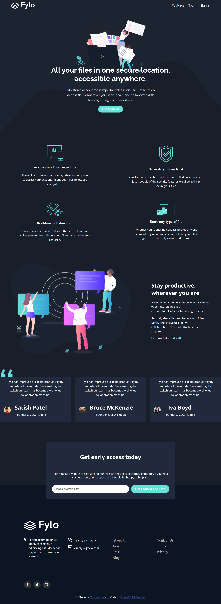
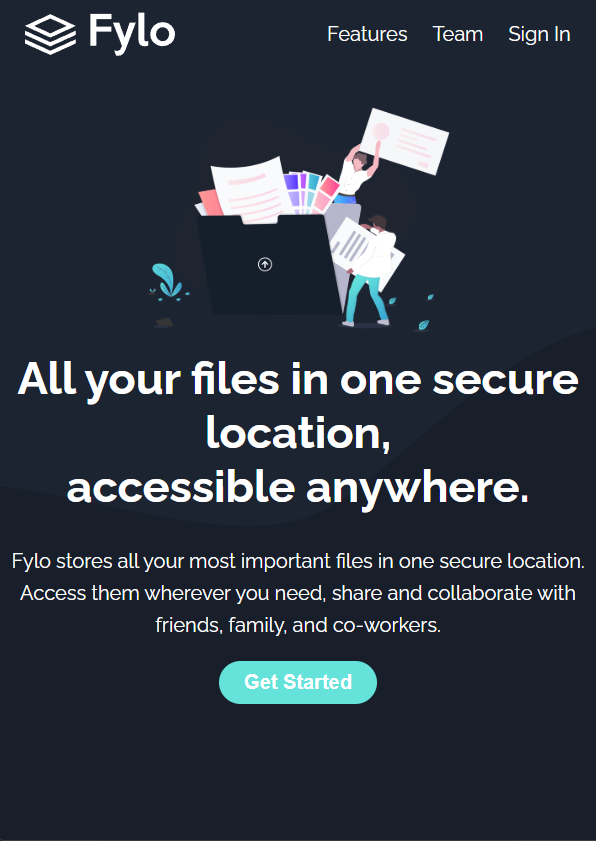

# Frontend Mentor - Fylo dark theme landing page solution

This is a solution to the [Fylo dark theme landing page challenge on Frontend Mentor](https://www.frontendmentor.io/challenges/fylo-dark-theme-landing-page-5ca5f2d21e82137ec91a50fd). Frontend Mentor challenges help you improve your coding skills by building realistic projects. 

## Table of contents

- [Overview](#overview)
  - [The challenge](#the-challenge)
  - [Screenshot](#screenshot)
  - [Links](#links)
- [My process](#my-process)
  - [Built with](#built-with)
  - [What I learned](#what-i-learned)
  - [Continued development](#continued-development)
  - [Useful resources](#useful-resources)
- [Author](#author)

## Overview

### The challenge

Users should be able to:

- View the optimal layout for the site depending on their device's screen size.
- See hover states for all interactive elements on the page.
- View a responsive layout on both desktop and mobile.

### Screenshot

  
Desktop View

  

  
Mobile View

  

### Links

- [Solution on GitHub](https://github.com/Lasse-Rodal/Fylo-dark-theme-landing-page-Frontend-Mentor-Challenge)
- [Live Site on GitHub Pages](https://lasse-rodal.github.io/Fylo-dark-theme-landing-page-Frontend-Mentor-Challenge/)

## My process

### Built with

- Semantic HTML5 markup
- CSS custom properties
- Flexbox and CSS Grid
- Mobile-first responsive design
- Vanilla JavaScript (for demo button interactivity)
- Accessibility best practices (e.g. `aria-label`s for social links)

### What I learned

This project helped reinforce:

- The power of semantic HTML and reusable utility classes (`.text-sm`, `.body-big`, etc.)
- Using `` instead of ` ` for more control over multiline text styling
- Layering elements with `z-index` to create visual depth
- Structuring a responsive grid layout using `minmax()` and `auto-fit`

### Continued development

Next, I’d like to:

- Convert this project into a React component-based structure.
- Implement form validation in the “Get Access” section.
- Explore animating testimonials using JavaScript or CSS transitions.

## Author

- Github - [Lasse Rodal Pedersen](https://github.com/Lasse-Rodal)
